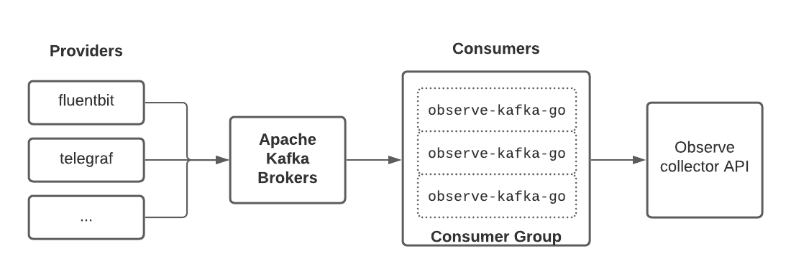
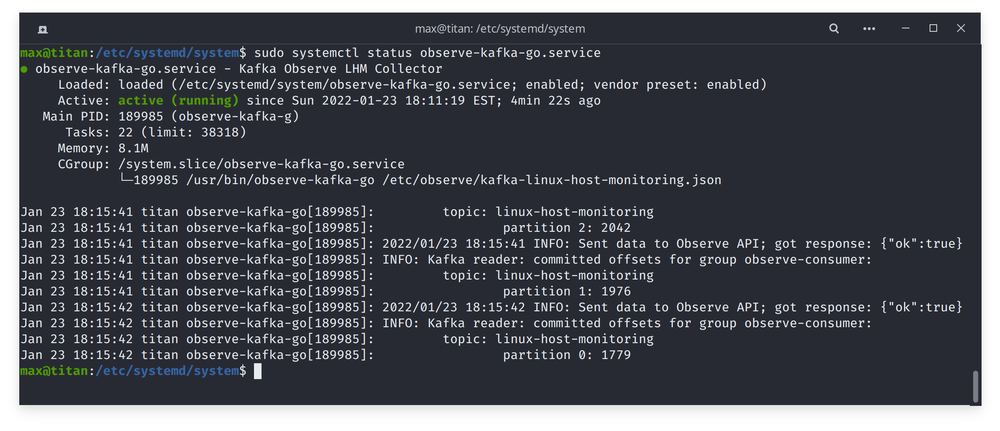
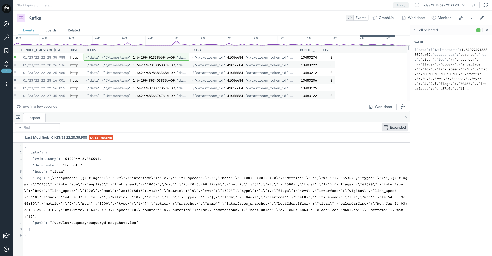

# observe-kafka-go

Unofficial Observe Apache Kafka consumer

## High-level Architecture



## Instructions

### Build the binary

```sh
git clone https://github.com/rustomax/observe-kafka-go.git
cd observe-kafka-go
go mod tidy
go build
```

### Create configuration file

Create config file. i.e. `/etc/observe/kafka-linux-host-monitoring.json`, replacing placeholders with correct values.

```sh
{
    "apiUrl": "collect.observeinc.com/v1/http",
    "extraPath": "observe/collector/host",
    "customer": "<OBSERVE_CUSTOMER_NUMBER>",
    "token": "<OBSERVE_TOKEN>",
    "topic": "<KAFKA_TOPIC",
    "brokerAddress": "<KAFKA_BROKER_URI",
    "consumerGroup": "<KAFKA_CONSUMER_GROUP"    
}
```

For example:

```json
{
    "apiUrl": "collect.observeinc.com/v1/http",
    "extraPath": "observe/collector/host",
    "customer": "123456789012",
    "token": "super-secret-datastream-token-generated-by-observe",
    "topic": "linux-host-monitoring",
    "brokerAddress": "kafka1.home:9092",
    "consumerGroup": "observe-consumer"
}
```

> If you change the location of the config file, don't forget to update systemd script `observe-kafka-go.service` with the path to the config file `ExecStart=/usr/bin/observe-kafka-go /etc/observe/kafka-linux-host-monitoring.json`

### Install the binary

```sh
sudo mv observe-kafka-go /usr/bin/
sudo chown root.root /usr/bin/observe-kafka-go
chmod 755 /usr/bin/observe-kafka-go
```

### Configure rsyslog
```sh
sudo cp scripts/40-observe-kafka-go.conf /etc/rsyslog.d
sudo mkdir /var/log/observe/
sudo chown syslog.adm /var/log/observe/
```

### Install systemd service

```sh
sudo cp scripts/observe-kafka-go.service /etc/systemd/system/
sudo chown root.root /etc/systemd/system/observe-kafka-go.service
sudo systemctl daemon-reload
sudo systemctl enable --now observe-kafka-go.service
```

## Verification

### Check that service is running and sending data to Observe

```sh
sudo systemctl status observe-kafka-go
```



### Review the detailed consumer log

```sh
tail -f /var/log/observe/observe-kafka-go.log
```

### Check that the data is coming into Observe

Verify that the datastream (or the Observation table) is receiving the events, i.e.


