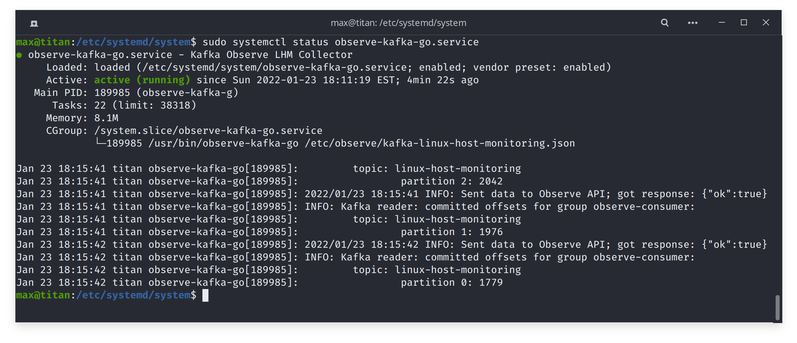

# observe-kafka-go

Unofficial Observe Apache Kafka consumer


## Instructions

### Build the binary

```sh
git clone https://github.com/rustomax/observe-kafka-go.git
cd observe-kafka-go
go mod tidy
go build
```

### Create configuration file

Create config file `/etc/observe/kafka-linux-host-monitoring.json`, replacing placeholders with correct values.

```sh
{
    "apiUrl": "collect.observeinc.com/v1/http",
    "extraPath": "observe/collector/host",
    "customer": "<OBSERVE_CUSTOMER_NUMBER>",
    "token": "<OBSERVE_TOKEN>"
}
```

> The configuration above works with the newer Datastreams API. To ingest into the conventional Observations API, please change the apiUrl to point to `collect.observeinc.com/v1/observations` and, instead of using the datastream token, provide your customer token.

> If you change the location of the config file, don't forget to update systemd script `observe-kafka-go.service` with the path to the config file `ExecStart=/usr/bin/observe-kafka-go /etc/observe/kafka-linux-host-monitoring.json`

### Install the binary and systemd service

```sh
sudo mv observe-kafka-go /usr/bin/
sudo chown root.root /usr/bin/observe-kafka-go
sudo cp observe-kafka-go.service /etc/systemd/system/
sudo chown root.root /etc/systemd/system/observe-kafka-go.service
sudo systemctl daemon-reload
sudo systemctl enable --now observe-kafka-go.service
```

### Check that service is running and sending data to Observe

```sh
sudo systemctl status observe-kafka-go
```

